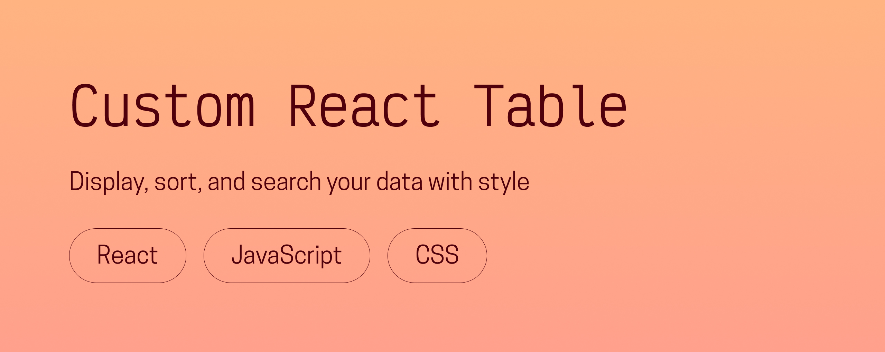

# Custom React Table

Need a light, customizable, and easy-to-use table component to display data in your React app? Look no further!  
This ~18kb React component allows you to display complex data in a clean, accessible table, complete with pagination, a search system, and sorting by each category. Let’s dive right in!

## Prerequisites
- [NodeJS (version 16.17.0)](https://nodejs.org/en/)
- [NPM (version 9.4.0)](https://www.npmjs.com/)
- [React (version 18.2.0)](https://react.dev/)

## Getting started

### Installation
    npm install @chloeadriancreates/custom-react-table

### Usage
    import { useState } from "react";
    import { Table } from "@chloeadriancreates/custom-react-table";

    const YourComponent = () => {
      const [content, setContent] = useState([
        {
          animal: "manatee",
          color: "turquoise",
          food: "pizza"
        },
        {
          animal: "deer",
          color: "lavender",
          food: "sushi"
        }
      ]);

      return <Table content={content} />;
    };

The only required prop is `content`, which takes an array of objects, with each object representing a table row and each key a column.

---

## Further customization
The `Table` component offers several options to make it fit seamlessly into your app’s design and data structure.

### 🎨 Colors
A color theme is calculated based on one main color, which by default is a medium warm grey.  

You can easily customize it to fit your app’s design system by passing a hex code (3 or 6 characters) to the `color` prop.

The font inherits from the parent component, so you can simply set the `font-family` where you use the table.

    <Table content={content} color="#577399" />

---

### 📅 Date format
The `Table` component automatically detects ISO date strings and formats them with [Day.js](https://day.js.org/en/).  

By default, the format is `"DD/MM/YYYY"`, but you can customize it by passing any valid [Day.js format token](https://day.js.org/docs/en/parse/string-format) to the `dateFormat` prop.

    <Table content={content} dateFormat="MM/DD/YY" />

---

### 🧩 Object flattening
If a row in your table (each object in `content`) contains another object, you can choose which nested property to display.

For example: 

    {
      color: "purple",
      animals: { 
        pastFavorite: "unicorn", 
        currentFavorite: "panda" 
      }
    }

You can tell the table which property to show by using the `objectKey` prop:

    <Table content={content} objectKey={{ animals: "pastFavorite" }} />

The `objectKey` object can contain as many properties as your `content` includes.  
However, this is **only one level deep**: further nested objects or arrays are not supported yet.

---

## Accessibility
The component is built with accessibility in mind:
- Semantic HTML table structure
- Keyboard navigation for pagination and sorting
- Visible focus states based on your color theme
- ARIA attributes (`aria-sort`) for screen readers

---

## Future updates
These are some planned improvements:
- Support for arrays inside row objects
- Responsive/mobile layout

---

Thanks for reading, and happy coding!  
Chloé Adrian ✨